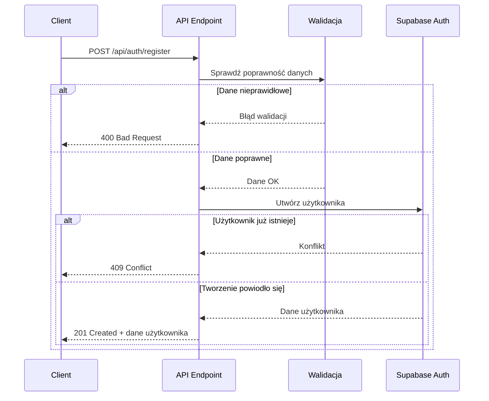

# API Endpoint Implementation Plan: Register User

## 1. Przegląd punktu końcowego
Endpoint `/api/auth/register` umożliwia rejestrację nowego użytkownika w systemie poprzez wykorzystanie Supabase Auth. Przyjmuje email i hasło, waliduje je, tworzy nowe konto użytkownika w tabeli `auth.users` i zwraca podstawowe informacje o utworzonym użytkowniku.

## 2. Szczegóły żądania
- Metoda HTTP: POST
- Struktura URL: `/api/auth/register`
- Request Body:
  ```json
  {
    "email": "string",
    "password": "string"
  }
  ```
- Wymagane pola:
  - `email`: poprawny adres email
  - `password`: hasło spełniające wymogi bezpieczeństwa (minimum 6 znaków)

## 3. Wykorzystywane typy
```typescript
// Z src/types.ts
import { 
  RegisterUserDto, 
  RegisterUserResponseDto 
} from "../../types";

// Dodatkowe typy potrzebne do walidacji
import { z } from 'zod';

// Schema walidacyjny
export const registerUserSchema = z.object({
  email: z.string()
    .email("Podaj poprawny adres email")
    .min(1, "Email jest wymagany"),
  password: z.string()
    .min(6, "Hasło musi mieć co najmniej 6 znaków")
});

export type RegisterUserInput = z.infer<typeof registerUserSchema>;
```

## 4. Szczegóły odpowiedzi
- Sukces (201 Created):
  ```json
  {
    "id": "uuid",
    "email": "string"
  }
  ```
- Błędy:
  - 400 Bad Request: Nieprawidłowe dane wejściowe
  - 409 Conflict: Email jest już zajęty
  - 500 Internal Server Error: Ogólny błąd serwera

## 5. Przepływ danych
1. Request trafia do endpointu `/api/auth/register`
2. Dane z request body są walidowane przy użyciu schematu Zod
3. Po walidacji używamy Supabase Auth API do utworzenia nowego użytkownika
4. Supabase tworzy nowy rekord w tabeli `auth.users`
5. Zwracamy dane utworzonego użytkownika (id, email)



## 6. Względy bezpieczeństwa
- **Walidacja wejścia**: Wykorzystujemy Zod do walidacji danych wejściowych, aby zapobiec atakom injection
- **Hasła**: Supabase Auth automatycznie haszuje hasła, nie przechowujemy ich w postaci czystego tekstu
- **Polityka haseł**: Wymuszamy minimum 6 znaków dla hasła zgodnie z konfiguracją Supabase
- **Limity prób**: Supabase Auth ma wbudowane ograniczenia liczby prób rejestracji z jednego adresu IP
- **HTTPS**: Wszystkie żądania powinny być obsługiwane przez HTTPS dla zapewnienia szyfrowania danych

## 7. Obsługa błędów
- **Nieprawidłowe dane wejściowe (400 Bad Request)**:
  - Brak wymaganych pól
  - Nieprawidłowy format email
  - Hasło nie spełnia wymagań minimalnych
- **Email już istnieje (409 Conflict)**:
  - Użytkownik o podanym adresie email już istnieje w systemie
- **Błąd serwera (500 Internal Server Error)**:
  - Problemy z połączeniem z Supabase
  - Nieoczekiwane błędy podczas przetwarzania żądania

## 8. Rozważania dotyczące wydajności
- **Rate limiting**: Wykorzystanie wbudowanych limitów Supabase dla operacji rejestracji
- **Logowanie**: Minimalne logowanie dla celów diagnostycznych, bez danych osobowych
- **Cache**: Brak cache dla operacji rejestracji, ponieważ są to operacje jednorazowe

## 9. Etapy wdrożenia
1. Utworzenie pliku `src/lib/validation/auth.schemas.ts` z definicją schematu walidacyjnego
   ```typescript
   import { z } from 'zod';

   export const registerUserSchema = z.object({
     email: z.string()
       .email("Podaj poprawny adres email")
       .min(1, "Email jest wymagany"),
     password: z.string()
       .min(6, "Hasło musi mieć co najmniej 6 znaków")
   });

   export type RegisterUserInput = z.infer<typeof registerUserSchema>;
   ```

2. Utworzenie serwisu `src/lib/services/auth.service.ts` do obsługi logiki autoryzacji
   ```typescript
   import type { SupabaseClient } from "@supabase/supabase-js";
   import type { UUID } from "../../types";

   /**
    * Registers a new user with the provided email and password
    *
    * @param supabase - The Supabase client instance
    * @param email - User's email
    * @param password - User's password
    * @returns Object containing the new user's ID and email
    * @throws Error if registration fails
    */
   export async function registerUser(
     supabase: SupabaseClient,
     email: string,
     password: string
   ): Promise<{ id: UUID; email: string }> {
     try {
       const { data, error } = await supabase.auth.signUp({
         email,
         password,
       });

       if (error) {
         // Handle specific error types
         if (error.message.includes("already registered")) {
           throw new Error("Email already in use");
         }
         throw new Error(`Registration failed: ${error.message}`);
       }

       if (!data.user) {
         throw new Error("No user data returned from registration");
       }

       return {
         id: data.user.id,
         email: data.user.email || email,
       };
     } catch (error) {
       console.error("Error during user registration:", error);
       throw error;
     }
   }
   ```

3. Implementacja endpointu API `src/pages/api/auth/register.ts`
   ```typescript
   import type { APIRoute } from "astro";
   import { registerUserSchema } from "../../../lib/validation/auth.schemas";
   import { registerUser } from "../../../lib/services/auth.service";
   import type { RegisterUserResponseDto } from "../../../types";

   export const prerender = false;

   export const POST: APIRoute = async ({ request, locals }) => {
     const supabase = locals.supabase;

     try {
       // Parse and validate request body
       const body = await request.json();
       const result = registerUserSchema.safeParse(body);

       if (!result.success) {
         return new Response(
           JSON.stringify({
             error: "Invalid input",
             details: result.error.format(),
           }),
           { status: 400, headers: { "Content-Type": "application/json" } }
         );
       }

       const { email, password } = result.data;

       // Register the user
       try {
         const user = await registerUser(supabase, email, password);

         // Return the created user
         const response: RegisterUserResponseDto = {
           id: user.id,
           email: user.email,
         };

         return new Response(JSON.stringify(response), { 
           status: 201, 
           headers: { "Content-Type": "application/json" } 
         });
       } catch (error) {
         // Handle user already exists error
         if (error instanceof Error && error.message.includes("already in use")) {
           return new Response(
             JSON.stringify({
               error: "Email already in use",
               message: "A user with this email address already exists",
             }),
             { status: 409, headers: { "Content-Type": "application/json" } }
           );
         }
         // Re-throw other errors to be caught by the general error handler
         throw error;
       }
     } catch (error) {
       console.error("Error during registration:", error);

       return new Response(
         JSON.stringify({
           error: "Internal server error",
           message: error instanceof Error ? error.message : "Unknown error occurred",
         }),
         { status: 500, headers: { "Content-Type": "application/json" } }
       );
     }
   };
   ```

4. Aktualizacja testów (jeśli istnieją) lub utworzenie nowych testów dla endpointu
5. Przeprowadzenie code review przed wdrożeniem
6. Wdrożenie zmian i monitorowanie logów pod kątem błędów
</rewritten_file> 